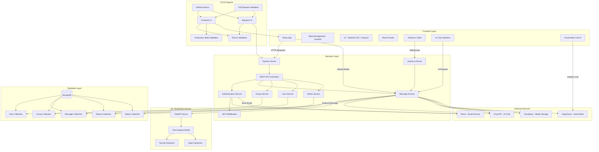

<br/>


# PASO – AI-Powered Real-Time Chat App (React + Node.js + Socket.io + ML Integration)

PASO is a production-level real-time communication platform inspired by WhatsApp, enhanced with **Machine Learning capabilities**, **AI automation**, and full multimedia support. It integrates messaging, voice/video communication, intelligent moderation, and admin analytics into a complete chat ecosystem.

---

## Architecture

The application follows a scalable decoupled architecture designed to efficiently manage real-time communication, AI services, and ML-based moderation.



## Screenshots

## Authentication
<p align="center"> 
    
</p>

## Chat Interface
<p align="center">
     </p> 
    <p align="center"> </p>
    <p align="center"> </p>
    <p align="center"> </p>

## AI Chat
<p align="center">  </p>

## Calling
<p align="center">  </p>

## Status page
<p align="center">  </p>

## Admin Panel
<p align="center">  </p> 
<p align="center">  </p> 
<p align="center">  </p>

## Features

Authentication System

- Secure sign up with full name, email, password
- Security questions (3-level verification)
- Forgot password with identity verification
- Email notifications via Brevo

UI and Customization

- Built with DaisyUI and Tailwind CSS
- Dynamic themes
- Chat wallpapers

AI Integration
- AI chatbot powered by Groq API

Messaging System

- One-to-one chat
- Group chat with admin roles

Features:

- Message status (single/double/blue tick)
- Reactions
- Pin messages
- Reply system
- Copy text
- Delete (me / everyone)


Reporting and Moderation
- Message reporting system
- ML-based moderation
- Admin review pipeline

Search System

- Global message search
- Highlighted results

Calling Features

Voice and video calls (ZegoCloud)
- Admin Panel
- Analytics dashboard
- User management
- Report management
- CSV export

##  Machine Learning Service

Run Locally : 
```bash
cd ml-service
uvicorn app:app --host 0.0.0.0 --port 8000 --reload
```

## ML Features
- Toxic Message Detection (ML-based)
- Spam Detection (ML-based)

See [ML_MODEL.md](./ML_MODEL.md) for detailed implementation.

## Tech Stack

## Frontend:

- React.js
- Tailwind CSS
- DaisyUI

Backend:

- Node.js
- Express.js
- Socket.io

Database:

- MongoDB

Services:

- Cloudinary
- Brevo
- Groq API
- ZegoCloud
- FastAPI (ML service)

## Deployment

- Frontend: Vercel

- Backend: Render

- ml-service: Render

## CI/CD Pipeline

- GitHub Actions powered CI workflows
- Automated frontend lint + production build validation
- Automated backend lint validation
- Pull request validation before merge
- npm ci based deterministic installs

## Environment Variables

Backend

```bash
MONGODB_URI=
PORT=5001
JWT_SECRET=
NODE_ENV=

CLOUDINARY_CLOUD_NAME=
CLOUDINARY_API_KEY=
CLOUDINARY_API_SECRET=

GROQ_API_KEY=

ZEGO_APP_ID=
ZEGO_SERVER_SECRET=

CLIENT_URL=https://chat-app-sooty-mu.vercel.app
BREVO_API_KEY=xxx-xxx-xxx

ML_SERVICE_URL=https://chat-app-1-bj8j.onrender.com/analyze

BASE_URL=http://localhost:5000

VITE_ZEGO_APP_ID=
VITE_ZEGO_SERVER_SECRET=
VITE_BACKEND_URL=http://localhost:5001
```

Frontend

```bash
VITE_ZEGO_APP_ID= (put it in frontend also if not work through backend)
VITE_ZEGO_SERVER_SECRET= (put it in frontend also if not work through backend)
# VITE_BACKEND_URL=https://chat-app-xsng.onrender.com
VITE_BACKEND_URL=http://localhost:5001
```

# Local Development Setup

## Prerequisites

Before running the project locally, make sure you have installed:

- Node.js
- MongoDB Atlas account or local MongoDB
- Docker Desktop (required for Redis)
- Python (for ML service)

---

# 1. Clone Repository

```bash
git clone https://github.com/CodePlaygroundHub/paso-chat-app.git
cd paso-chat-app
```

---

# 2. Start Redis Server (Required)

This project uses Redis for realtime pub/sub communication.

Make sure Docker Desktop is installed and running locally before executing the command below.

Run Redis using Docker:

```bash
docker run --name redis -p 6379:6379 redis
```

Keep this terminal running.

---

# 3. Configure Environment Variables

Create `.env` files inside:

```bash
/backend
/frontend
```

Use the provided `.env.example` files as reference.

Important:
- Add your MongoDB Atlas URI
- Add your Groq API key
- Add your Cloudinary credentials
- Add your ZegoCloud credentials

---

# 4. Allow MongoDB Atlas Network Access

If using MongoDB Atlas:

Go to:

Security → Network Access

Add:

```txt
0.0.0.0/0
```

or whitelist your current IP address.

---

# 5. Start Backend Server

Open a new terminal:

```bash
cd backend
npm install
npm run dev
```

Expected output:

```bash
✅ Redis connected
✅ MongoDB connected
Server running on port 5001
```

---

# 6. Start Frontend

Open another terminal:

```bash
cd frontend
npm install
npm run dev
```

---

# 7. Start ML Service (Optional but Recommended)

Open another terminal:

```bash
cd ml-service
pip install -r requirements.txt
uvicorn app:app --host 0.0.0.0 --port 8000 --reload
```

---

# Application URLs

| Service | URL |
|---|---|
| Frontend | http://localhost:5173 |
| Backend | http://localhost:5001 |
| ML Service | http://localhost:8000 |


## Documentation

Detailed project documentation is available inside the `docs/` directory.

| Document | Description |
|---|---|
| `docs/ARCHITECTURE.md` | Complete system architecture |
| `docs/BACKEND.md` | Backend structure and workflow |
| `docs/FRONTEND.md` | Frontend architecture and state management |
| `docs/API.md` | REST API documentation |
| `docs/SOCKETS.md` | Socket.io realtime architecture |
| `docs/ML_SERVICE.md` | Machine learning moderation service |
| `docs/SETUP.md` | Local development setup guide |

## Project Highlights

- Real-time chat with Socket.io
- AI chatbot integration
- ML-based moderation system
- Full admin analytics panel
- Voice and video communication
- Scalable architecture
- Open-source contribution ready

## Contributing

- Check Issues
- Pick a task
- Submit a Pull Request

## Future Improvements
- Advanced ML moderation
- Notifications system
- Mobile optimization
- UI/UX improvements

## 🤝 Contributing
Contributions are welcome!  
See [CONTRIBUTING.md](./CONTRIBUTING.md)

Author

Akash Santra

---

## Community Guidelines

- Code of Conduct: [CODE_OF_CONDUCT.md](./CODE_OF_CONDUCT.md)
- Security Policy: [SECURITY.md](./SECURITY.md)
