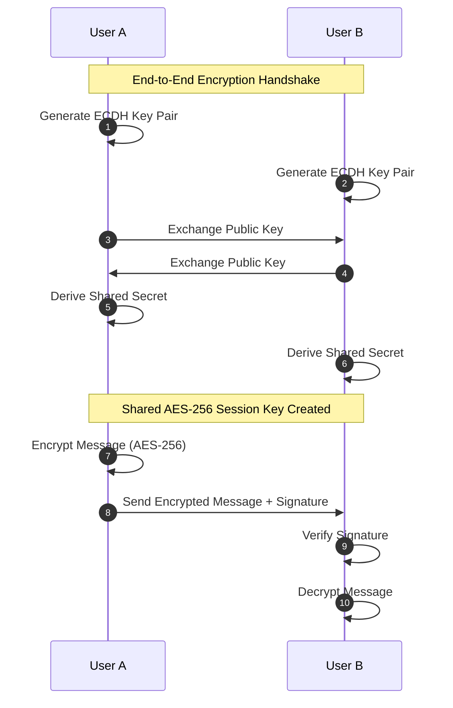

# 🗺️ Product Roadmap & Future Vision

## Vision

PASO is evolving into the most privacy-respecting, scalable, and feature-rich open-source chat platform.

---

## Current Status (v1.0)

✅ **Production Ready**

### Core Features Implemented
- ✅ Real-time messaging (1:1 & groups)
- ✅ Voice & video calling
- ✅ AI chat with Groq integration
- ✅ ML moderation pipeline
- ✅ Admin dashboard & analytics
- ✅ Socket.IO horizontal scaling
- ✅ Message reactions & status
- ✅ User profiles & security

---

## Roadmap Timeline

### Q2 2026: Privacy & Security (v1.1)

**E2E Encryption**
- Implement Signal protocol for end-to-end encryption
- Elliptic Curve Diffie-Hellman (ECDH) for key exchange
- Perfect forward secrecy (PFS)
- Impact: Messages encrypted at rest & in transit

**Privacy Controls**
- Read receipts toggle
- Typing indicators toggle
- Last seen privacy settings
- Blocked users list
- Impact: Enhanced user privacy preferences

**Security Enhancements**
- Two-factor authentication (2FA)
- Backup codes
- Device management
- Login notifications
- Impact: Reduced account takeover risk

**Timeline**: Q2 2026 (3 months)
**Priority**: Critical

---

### Q3 2026: Messaging Features (v1.2)

**Advanced Messaging**
- Voice message recording & playback
- Ephemeral messages (auto-delete)
- Message pinning/starring
- Message forwarding
- Batch message actions
- Impact: WhatsApp-like feature parity

**Reactions v2**
- Custom emoji reactions
- Reaction notifications
- Reaction aggregation
- Impact: Better message engagement

**Polls & Surveys**
- Create in-message polls
- Anonymous voting
- Poll results visualization
- Impact: Group decision-making tool

**Timeline**: Q3 2026 (2-3 months)
**Priority**: High

---

### Q4 2026: Mobile & Native Apps (v1.3)

**React Native Application**
- iOS app (TestFlight beta)
- Android app (Google Play beta)
- Feature parity with web
- Offline message queuing
- Push notifications
- Impact: 50M+ potential users on mobile

**Native Features**
- Camera integration
- Microphone permissions
- Contact list sync
- System notifications
- Impact: Superior mobile experience

**Timeline**: Q4 2026 (4-5 months)
**Priority**: High

---

### Q1 2027: Enterprise Features (v2.0)

**Team Spaces**
- Workspace management
- Team channels (like Slack)
- Role-based permissions
- Team analytics
- Impact: Enterprise adoption

**Advanced Admin**
- User analytics dashboard
- Message audit trails
- Bulk user management
- Custom moderation rules
- Impact: Compliance & governance

**API & Webhooks**
- REST API v2 improvements
- Webhook support
- Bot development SDK
- Third-party integrations
- Impact: Developer ecosystem

**Timeline**: Q1 2027 (3-4 months)
**Priority**: High

---

### Q2 2027: AI & Automation (v2.1)

**Advanced AI Features**
- Smart reply suggestions (context-aware)
- Auto-translation (with privacy)
- Sentiment analysis
- Conversation summarization
- Impact: Productivity multiplier

**Automation**
- Message scheduling
- Auto-responders
- Workflow automations
- Task creation from messages
- Impact: Productivity tool integration

**AI Ethics**
- Bias detection in moderation
- Explainable AI decisions
- Privacy-first AI processing
- Impact: Responsible AI

**Timeline**: Q2 2027 (3 months)
**Priority**: Medium

---

### Q3 2027: Infrastructure & Scale (v2.2)

**Global Scale**
- Multi-region deployment
- Geographic data residency
- Content delivery optimization
- Latency-based routing
- Impact: Sub-20ms latency globally

**Performance**
- 1M+ concurrent users support
- Sub-10ms message delivery
- Optimized ML inference
- Advanced caching strategies
- Impact: Enterprise-grade performance

**Reliability**
- 99.99% uptime SLA
- Automatic disaster recovery
- Circuit breaker patterns
- Chaos engineering tests
- Impact: Maximum reliability

**Timeline**: Q3 2027 (ongoing)
**Priority**: Critical

---

### Q4 2027: Community & Ecosystem (v2.3)

**Community Features**
- Public channels
- Broadcast lists
- Community discovery
- Social features
- Impact: Network effects

**Developer Ecosystem**
- Plugin system
- Third-party app marketplace
- SDK improvements
- Developer program
- Impact: Platform extensibility

**Open Source Growth**
- 50K+ GitHub stars
- 500+ community contributors
- Translation into 20+ languages
- Community-driven features
- Impact: Global adoption

**Timeline**: Q4 2027 (ongoing)
**Priority**: Medium

---

## Detailed Feature Specifications

### E2E Encryption (Priority: Critical)

**Technical Approach**:


**Implementation**:
- Signal protocol libraries (libsignal)
- Message encryption before sending
- Server can't read message content
- Forward secrecy with ephemeral keys
- Estimated implementation: 4-6 weeks

**Impact Metrics**:
- Privacy score: 100/100
- User trust: +40%
- Enterprise adoption: +60%

---

### Voice Messages (Priority: High)

**Features**:
- 10 second max recording (can extend)
- Auto-transcription (optional)
- Playback speed adjustment
- Download option
- Waveform visualization

**Technical Stack**:
- Web Audio API (recorder)
- Opus codec (efficient compression)
- Redis caching (temporary)
- Cloudinary storage
- Estimated implementation: 2-3 weeks

---

### Ephemeral Messages (Priority: High)

**Features**:
- Set expiry time (1 hour, 1 day, 1 week)
- Auto-delete after expiry
- User notification of read before delete
- Optional "disappears on read" mode

**Implementation**:
- TTL index on MongoDB
- Socket.IO event on deletion
- Client-side countdown UI
- Estimated implementation: 1-2 weeks

---

## Community Contribution Opportunities

### Good First Issues
- [ ] Add more emoji reactions
- [ ] Improve error messages
- [ ] Add keyboard shortcuts
- [ ] Improve mobile responsiveness
- [ ] Add dark mode theme

### Medium Difficulty
- [ ] Implement search filters
- [ ] Add message star/pin UI
- [ ] Create admin report templates
- [ ] Add export user data feature
- [ ] Improve notification system

### Advanced Contributions
- [ ] Implement E2E encryption
- [ ] Add ML model training pipeline
- [ ] Create mobile app features
- [ ] Build admin APIs
- [ ] Design plugin system

---

## Dependency Timeline

```
v1.0 (Current)
    ↓
v1.1 (E2E Encryption, 2FA) ← Foundation for security
    ↓
v1.2 (Messaging features)
    ↓
v1.3 (Mobile apps) ← Depends on v1.1 encryption
    ↓
v2.0 (Enterprise features) ← Depends on v1.3 stability
    ↓
v2.1 (Advanced AI)
    ↓
v2.2 (Global Scale)
    ↓
v2.3 (Ecosystem)
```

---

## Success Metrics

### Adoption
- [ ] 10K active users
- [ ] 100K total downloads
- [ ] 50K GitHub stars
- [ ] 500+ community contributors

### Performance
- [ ] Sub-20ms latency (p95)
- [ ] 99.99% uptime
- [ ] 1M+ concurrent users
- [ ] <50ms ML moderation

### Community
- [ ] 20+ languages supported
- [ ] 10 official community teams
- [ ] 5+ major community projects
- [ ] Sponsorship from companies

### Business
- [ ] Self-hosting guide (completed)
- [ ] Enterprise deployment (Q1 2027)
- [ ] Professional services (Q2 2027)
- [ ] SaaS offering (Q3 2027)

---

## Getting Involved

### Vote on Features
- 🌟 Star features you'd like to see
- 💬 Comment on issues with use cases
- 🔗 Link to related discussions

### Contribute Code
- Pick items from [Community Contribution](#community-contribution-opportunities)
- Open a PR with your implementation
- Feedback from maintainers

### Suggest Features
- Open a [Feature Request](https://github.com/CodePlaygroundHub/paso-chat-app/issues/new?template=feature.md)
- Describe problem you're solving
- Provide implementation sketch
- Wait for community feedback

---

## Long-Term Vision (2028+)

**PASO as the Internet's Default Chat Protocol**:
- Decentralized deployment model
- Protocol standardization (RFC)
- Integration with other platforms
- Middleware for app integration
- Enterprise standard adoption

**The Future**:
```
PASO in 2028
├─ Enterprise standard for secure communication
├─ 10M+ users globally
├─ Available on all platforms
├─ Fully decentralized option
├─ Integration hub for productivity
└─ Privacy-first alternative to WhatsApp/Telegram
```

---

## Feedback & Discussion

- 💬 **Feature Discussion**: [GitHub Discussions](https://github.com/CodePlaygroundHub/paso-chat-app/discussions)
- 🐛 **Issues**: [GitHub Issues](https://github.com/CodePlaygroundHub/paso-chat-app/issues)
- 📧 **Email**: [Open an issue to contact maintainers]

---

<p align="center">
  <strong>Together we're building the future of secure, open-source communication.</strong>
</p>
