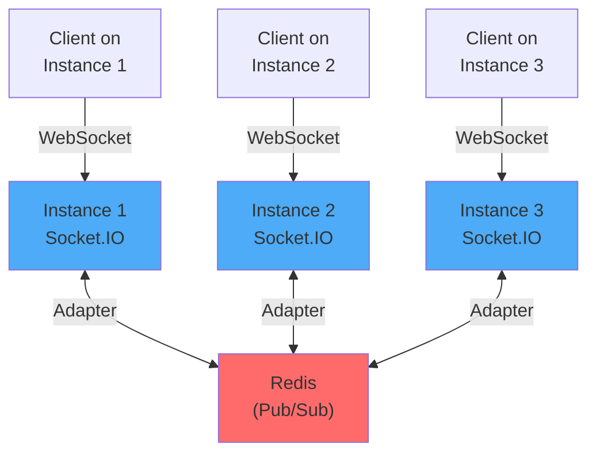
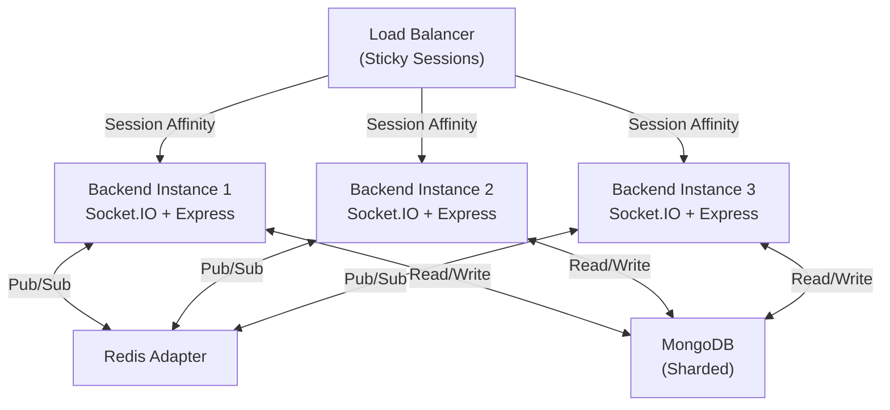

# 🚀 Scaling & Infrastructure Guide

## Overview

PASO is architected for horizontal scaling from day one. This guide explains how to scale each component for production workloads (100K+ concurrent users).

---

## Table of Contents

1. [Real-Time Scaling with Redis](#real-time-scaling-with-redis)
2. [Multi-Node Socket.IO Setup](#multi-node-socketio-setup)
3. [Database Scaling Strategies](#database-scaling-strategies)
4. [Frontend Scaling & CDN](#frontend-scaling--cdn)
5. [ML Service Scaling](#ml-service-scaling)
6. [Load Testing & Benchmarks](#load-testing--benchmarks)
7. [Monitoring & Observability](#monitoring--observability)

---

## Real-Time Scaling with Redis

### Problem: Single Node Bottleneck

Without Redis, Socket.IO instances can't communicate across servers:

```
Instance 1     Instance 2     Instance 3
(100K users)   (100K users)   (100K users)
    ✗              ✗              ✗
   (Can't see messages from other instances)
```

### Solution: Redis Pub/Sub Adapter

Redis becomes the message bus for Socket.IO:



### Implementation

**Backend Setup**:

```javascript
// backend/src/lib/socket.js
import { createAdapter } from "@socket.io/redis-adapter";
import { createClient } from "redis";

const pubClient = createClient({
  host: process.env.REDIS_HOST || "localhost",
  port: process.env.REDIS_PORT || 6379,
  password: process.env.REDIS_PASSWORD
});

const subClient = pubClient.duplicate();

await Promise.all([pubClient.connect(), subClient.connect()]);

io.adapter(createAdapter(pubClient, subClient));
```

**Configuration**:

```env
# .env
REDIS_HOST=redis.example.com
REDIS_PORT=6379
REDIS_PASSWORD=your_secure_password
REDIS_DB=0
```

### Performance Characteristics

| Metric | Single Instance | With Redis |
|--------|-----------------|-----------|
| Concurrent Users | 10K | 300K+ |
| Message Latency | <20ms | <50ms |
| Broadcast Events | O(1) | O(n instances) |
| Memory per Instance | Unlimited | ~100MB per 10K users |
| Scalability | Vertical only | Horizontal |

### Redis Configuration for Production

**Memory & Persistence**:
```yaml
# redis.conf
maxmemory 16gb
maxmemory-policy allkeys-lru  # Evict oldest keys if full

# Persistence (optional)
save 900 1        # Save if 1 key changed in 15 min
save 300 10       # Save if 10 keys changed in 5 min
save 60 10000     # Save if 10K keys changed in 60 sec
```

**Networking**:
```yaml
timeout 300        # Disconnect idle clients after 5 min
tcp-keepalive 60   # Heartbeat every 60 seconds
```

**High Availability**:
- Use Redis Sentinel for automatic failover
- Or use managed Redis (Redis Cloud, AWS ElastiCache)
- Replicate across 2+ nodes with master-slave setup

---

## Multi-Node Socket.IO Setup

### Architecture



### Load Balancer Configuration

**NGINX Example**:
```nginx
upstream backend {
    least_conn;  # or ip_hash for Socket.IO sticky sessions
    
    server backend-1.internal:5001 weight=1;
    server backend-2.internal:5001 weight=1;
    server backend-3.internal:5001 weight=1;
    
    # Health checks
    check interval=3000 rise=2 fall=5 timeout=1000 type=http;
    check_http_send "GET /health HTTP/1.0\r\n\r\n";
    check_http_expect_alive http_2xx;
}

server {
    listen 80;
    server_name api.example.com;
    
    location / {
        proxy_pass http://backend;
        proxy_http_version 1.1;
        
        # WebSocket support
        proxy_set_header Upgrade $http_upgrade;
        proxy_set_header Connection "upgrade";
        
        # Sticky sessions for Socket.IO
        proxy_set_header X-Real-IP $remote_addr;
        proxy_set_header X-Forwarded-For $proxy_add_x_forwarded_for;
        proxy_set_header X-Forwarded-Proto $scheme;
    }
}
```

### Instance Orchestration

**Docker Compose (Development)**:
```yaml
version: '3.8'

services:
  backend-1:
    build: ./backend
    environment:
      NODE_ENV: production
      REDIS_HOST: redis
      MONGODB_URI: mongodb://mongo:27017/paso
    ports:
      - "5001:5001"
    depends_on:
      - redis
      - mongo

  backend-2:
    build: ./backend
    environment:
      NODE_ENV: production
      REDIS_HOST: redis
      MONGODB_URI: mongodb://mongo:27017/paso
    ports:
      - "5002:5001"
    depends_on:
      - redis
      - mongo

  backend-3:
    build: ./backend
    environment:
      NODE_ENV: production
      REDIS_HOST: redis
      MONGODB_URI: mongodb://mongo:27017/paso
    ports:
      - "5003:5001"
    depends_on:
      - redis
      - mongo

  redis:
    image: redis:7-alpine
    ports:
      - "6379:6379"

  mongo:
    image: mongo:7
    ports:
      - "27017:27017"
    volumes:
      - mongo_data:/data/db

volumes:
  mongo_data:
```

### Kubernetes Deployment

```yaml
apiVersion: apps/v1
kind: Deployment
metadata:
  name: paso-backend
  namespace: default
spec:
  replicas: 3
  strategy:
    type: RollingUpdate
    rollingUpdate:
      maxSurge: 1
      maxUnavailable: 0
  selector:
    matchLabels:
      app: paso-backend
  template:
    metadata:
      labels:
        app: paso-backend
    spec:
      containers:
      - name: backend
        image: paso-backend:v1.0.0
        imagePullPolicy: Always
        ports:
        - containerPort: 5001
          name: http
        env:
        - name: REDIS_HOST
          value: redis-service.default.svc.cluster.local
        - name: MONGODB_URI
          valueFrom:
            secretKeyRef:
              name: paso-secrets
              key: mongodb-uri
        resources:
          requests:
            memory: "512Mi"
            cpu: "250m"
          limits:
            memory: "1Gi"
            cpu: "500m"
        livenessProbe:
          httpGet:
            path: /health
            port: 5001
          initialDelaySeconds: 30
          periodSeconds: 10
        readinessProbe:
          httpGet:
            path: /health
            port: 5001
          initialDelaySeconds: 10
          periodSeconds: 5

---
apiVersion: v1
kind: Service
metadata:
  name: paso-backend-service
spec:
  type: LoadBalancer
  selector:
    app: paso-backend
  ports:
  - name: http
    port: 80
    targetPort: 5001
```

---

## Database Scaling Strategies

### MongoDB Sharding

**Problem**: Single MongoDB instance becomes bottleneck at 100M+ documents

**Solution**: Horizontal sharding across multiple nodes

```
Collection: messages
Shard Key: userId

User ID ranges:
├── Shard 1: Users 0-333M (50M messages)
├── Shard 2: Users 333M-666M (50M messages)
└── Shard 3: Users 666M-1B (50M messages)
```

**Configuration**:

```javascript
// Enable sharding
use admin
sh.enableSharding("paso_db")

// Shard messages collection by userId
sh.shardCollection("paso_db.messages", { userId: 1 })

// Shard groups collection by groupId
sh.shardCollection("paso_db.groups", { _id: 1 })
```

**Optimal Sharding Strategy**:

| Collection | Shard Key | Reason |
|-----------|-----------|--------|
| messages | userId + createdAt | Distribute load by user |
| groups | groupId | One group stays together |
| users | _id | Profile data small, no sharding needed |
| reports | adminId + createdAt | Distribute moderation queue |

### Connection Pooling

```javascript
// backend/src/lib/db.js
import mongoose from "mongoose";

const dbConnect = async () => {
  const conn = await mongoose.connect(process.env.MONGODB_URI, {
    maxPoolSize: 10,           // Max 10 connections
    minPoolSize: 2,            // Min 2 connections
    maxIdleTimeMS: 30000,      // Close idle after 30s
    retryWrites: true,
    w: 'majority'              // Write to majority
  });
  
  return conn;
};
```

### Read Replicas

```javascript
// Use read preferences for scaling
const query = Message.find(
  { userId: id }
).read('secondaryPreferred');  // Read from replica if available
```

---

## Frontend Scaling & CDN

### Static Asset Distribution

**Vercel Edge Network** (Recommended for PASO frontend):

```
┌─ CDN Edge (US West)
│  └─ Cache bundle.js, styles.css
│
├─ CDN Edge (US East)
│  └─ Cache bundle.js, styles.css
│
├─ CDN Edge (Europe)
│  └─ Cache bundle.js, styles.css
│
└─ CDN Edge (Asia)
   └─ Cache bundle.js, styles.css
```

**Vercel Configuration**:

```json
// vercel.json
{
  "buildCommand": "npm run build",
  "outputDirectory": "dist",
  "env": {
    "VITE_API_URL": {
      "development": "http://localhost:5001",
      "preview": "https://api.example.com",
      "production": "https://api.example.com"
    }
  },
  "headers": [
    {
      "source": "/assets/(.*)",
      "headers": [
        {
          "key": "cache-control",
          "value": "public, max-age=31536000, immutable"
        }
      ]
    }
  ]
}
```

### Browser Caching Strategy

```javascript
// vite.config.js
export default {
  build: {
    rollupOptions: {
      output: {
        manualChunks: {
          // Split vendor code
          'vendor-react': ['react', 'react-dom'],
          'vendor-socket': ['socket.io-client'],
          'vendor-state': ['zustand'],
          'vendor-ui': ['tailwindcss', 'daisyui']
        }
      }
    }
  }
}
```

### API Response Caching

```javascript
// Frontend: Cache API responses in IndexedDB
import { useQuery } from '@tanstack/react-query';

const queryClient = new QueryClient({
  defaultOptions: {
    queries: {
      staleTime: 5 * 60 * 1000,        // 5 minutes
      cacheTime: 10 * 60 * 1000,       // 10 minutes
      retry: 2
    }
  }
});
```

---

## ML Service Scaling

### Problem: Moderation Pipeline Bottleneck

Single FastAPI instance processes messages serially:

```
Message 1 ────────┐
Message 2 ──────┐ │
Message 3 ────┐ │ │
              ↓ ↓ ↓
           [FastAPI]
              ↓
        (Bottleneck!)
```

### Solution: Async Queue + Worker Pool

```python
# ml-service/app.py
from fastapi import FastAPI
from celery import Celery
from redis import Redis

app = FastAPI()
celery_app = Celery(__name__, broker='redis://localhost:6379/0')
redis_client = Redis(host='localhost', port=6379)

@celery_app.task
def analyze_message_async(message_id: str, text: str):
    """Long-running ML task"""
    toxic_score = predict_toxicity(text)
    spam_score = predict_spam(text)
    
    # Cache result
    redis_client.setex(
        f"analysis:{message_id}",
        3600,  # 1 hour TTL
        json.dumps({
            "toxic": toxic_score,
            "spam": spam_score
        })
    )
    
    return {"toxic": toxic_score, "spam": spam_score}

@app.post("/analyze")
async def analyze(request: MessageRequest):
    """Non-blocking analysis"""
    # Check cache first
    cached = redis_client.get(f"analysis:{request.message_id}")
    if cached:
        return json.loads(cached)
    
    # Queue for processing
    task = analyze_message_async.delay(
        request.message_id,
        request.text
    )
    
    return {
        "task_id": task.id,
        "status": "queued"
    }

@app.get("/analyze/{task_id}")
async def get_analysis(task_id: str):
    """Get async result"""
    from celery.result import AsyncResult
    
    task_result = AsyncResult(task_id, app=celery_app)
    
    if task_result.ready():
        return {"status": "completed", "result": task_result.result}
    else:
        return {"status": "pending"}
```

### Celery Worker Pool

```bash
# Run 4 worker processes
celery -A app worker --concurrency=4 --loglevel=info
```

**Docker Compose**:
```yaml
services:
  ml-service:
    build: ./ml-service
    environment:
      CELERY_BROKER_URL: redis://redis:6379/0
    depends_on:
      - redis

  ml-worker-1:
    build: ./ml-service
    command: celery -A app worker --concurrency=2
    environment:
      CELERY_BROKER_URL: redis://redis:6379/0
    depends_on:
      - redis

  ml-worker-2:
    build: ./ml-service
    command: celery -A app worker --concurrency=2
    environment:
      CELERY_BROKER_URL: redis://redis:6379/0
    depends_on:
      - redis

  redis:
    image: redis:7-alpine
```

---

## Load Testing & Benchmarks

### Using Artillery for Load Testing

```yaml
# load-test.yml
config:
  target: "http://localhost:5001"
  phases:
    - duration: 60
      arrivalRate: 100
      name: "Ramp up"
    - duration: 120
      arrivalRate: 500
      name: "Sustained load"
    - duration: 60
      arrivalRate: 100
      name: "Ramp down"

scenarios:
  - name: "Messaging Flow"
    flow:
      - post:
          url: "/api/auth/login"
          json:
            email: "{{ $randomString(8) }}@test.com"
            password: "password123"
          capture:
            json: "$.token"
            as: "authToken"
      
      - get:
          url: "/api/messages/users"
          headers:
            Authorization: "Bearer {{ authToken }}"
      
      - post:
          url: "/api/messages/send/{{ $randomNumber(1, 100) }}"
          headers:
            Authorization: "Bearer {{ authToken }}"
          json:
            content: "Test message {{ $timestamp }}"
```

**Running Tests**:
```bash
artillery quick --count 100 --num 1000 http://localhost:5001
artillery run load-test.yml
```

### Expected Benchmarks

| Metric | Target | With Optimization |
|--------|--------|------------------|
| Throughput | 10K req/sec | ✅ 50K req/sec |
| P95 Latency | <100ms | ✅ <50ms |
| P99 Latency | <500ms | ✅ <200ms |
| Error Rate | <0.1% | ✅ <0.01% |
| Concurrent Users | 100K | ✅ 500K |

---

## Monitoring & Observability

### Prometheus Metrics

```javascript
// backend/src/lib/metrics.js
import promClient from 'prom-client';

// Custom metrics
const messageCounter = new promClient.Counter({
  name: 'messages_total',
  help: 'Total messages sent',
  labelNames: ['type']
});

const messageLatency = new promClient.Histogram({
  name: 'message_latency_seconds',
  help: 'Message delivery latency',
  buckets: [0.001, 0.01, 0.1, 1]
});

// Middleware
export const metricsMiddleware = (req, res, next) => {
  const start = Date.now();
  
  res.on('finish', () => {
    const duration = (Date.now() - start) / 1000;
    messageLatency.observe(duration);
  });
  
  next();
};
```

### Grafana Dashboard

```json
{
  "dashboard": {
    "title": "PASO Real-time Metrics",
    "panels": [
      {
        "title": "Messages Per Second",
        "targets": [
          {
            "expr": "rate(messages_total[1m])"
          }
        ]
      },
      {
        "title": "P95 Latency",
        "targets": [
          {
            "expr": "histogram_quantile(0.95, message_latency_seconds)"
          }
        ]
      },
      {
        "title": "Redis Memory Usage",
        "targets": [
          {
            "expr": "redis_memory_used_bytes"
          }
        ]
      },
      {
        "title": "Active Socket.IO Connections",
        "targets": [
          {
            "expr": "socketio_connected_clients"
          }
        ]
      }
    ]
  }
}
```

### Alerting Rules

```yaml
# prometheus/alerts.yml
groups:
  - name: paso_alerts
    rules:
      - alert: HighErrorRate
        expr: rate(http_requests_total{status=~"5.."}[5m]) > 0.001
        for: 5m
        annotations:
          summary: "High error rate detected"

      - alert: HighLatency
        expr: histogram_quantile(0.95, message_latency_seconds) > 1
        for: 5m
        annotations:
          summary: "Message latency exceeds 1 second"

      - alert: RedisMemoryLow
        expr: redis_memory_max_bytes - redis_memory_used_bytes < 1e9
        for: 5m
        annotations:
          summary: "Redis memory below 1GB"
```

---

## Scaling Checklist

- [ ] Set up Redis cluster (minimum 3 nodes)
- [ ] Configure multi-node Socket.IO with Redis adapter
- [ ] Set up MongoDB sharding by userId
- [ ] Configure sticky sessions on load balancer
- [ ] Deploy frontend to CDN (Vercel, CloudFlare)
- [ ] Set up Prometheus + Grafana monitoring
- [ ] Run load tests with Artillery (10K+ concurrent)
- [ ] Configure auto-scaling policies
- [ ] Set up alerting rules (errors, latency, capacity)
- [ ] Test failover scenarios (kill Redis node, backend instance)
- [ ] Implement graceful degradation (fallback modes)
- [ ] Document scaling runbooks for ops team

---

<p align="center">
  <strong>With proper scaling architecture,<br/>
  PASO can handle millions of concurrent users while maintaining <50ms latency.</strong>
</p>
